# AWS EKS GitOps Platform

> A production-style Kubernetes platform demonstrating real-world DevOps, GitOps, and cloud-native engineering practices on AWS.

## 🚀 Overview

This project provisions a secure EKS cluster using Terraform, deploys a containerized Flask application using Helm, automates the full deployment lifecycle using GitHub Actions and ArgoCD, and monitors the cluster using Prometheus and Grafana — demonstrating a complete, production-style cloud-native platform.

## 🎯 What This Project Demonstrates

- End-to-end Kubernetes platform deployment on AWS using Infrastructure as Code
- GitOps-based continuous delivery with ArgoCD
- Secure CI/CD pipeline using GitHub Actions with OIDC (no static credentials)
- Observability and monitoring with Prometheus and Grafana
- Kubernetes security hardening using RBAC and Network Policies
- Production-style architecture design and operational awareness

## 🧭 Architecture Diagram

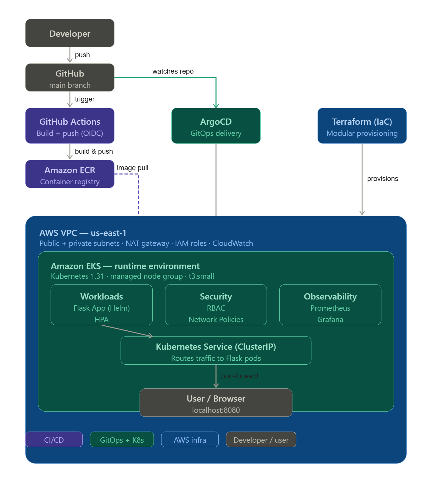

## 🧱 Architecture

- Amazon EKS cluster with managed node group
- Dockerized Flask application stored in ECR
- Helm charts for Kubernetes deployment
- GitHub Actions CI/CD pipeline (OIDC authentication)
- ArgoCD for GitOps continuous delivery
- Prometheus + Grafana for observability
- RBAC and Network Policies for security hardening

## ⚙️ CI/CD Pipeline Flow

1. Developer pushes code to GitHub
2. GitHub Actions builds Docker image
3. Image is pushed to Amazon ECR
4. ArgoCD detects Git changes and syncs Helm chart
5. Kubernetes schedules pods on EKS worker nodes
6. HPA scales pods based on CPU utilization
7. Prometheus scrapes metrics from all pods
8. Grafana visualizes cluster and application metrics
9. RBAC and Network Policies enforce least-privilege access

## 🛠 Tech Stack

| Layer | Technology |
|---|---|
| Cloud | AWS (EKS, ECR, VPC, IAM) |
| Infrastructure as Code | Terraform (modular) |
| Container Orchestration | Kubernetes 1.31 |
| Package Manager | Helm |
| GitOps | ArgoCD |
| CI/CD | GitHub Actions (OIDC) |
| Observability | Prometheus + Grafana |
| Security | RBAC + Network Policies |
| Application | Python Flask |

## 📁 Project Structure
aws-eks-gitops-platform/
├── terraform/
│   ├── main.tf
│   ├── variables.tf
│   └── modules/
│       ├── network/          # VPC, subnets, NAT gateway
│       └── eks/              # EKS cluster, node groups
├── app/
│   ├── app.py                # Flask application
│   ├── requirements.txt
│   └── Dockerfile
├── helm/
│   └── flask-app/            # Helm chart
│       └── templates/
│           ├── deployment.yaml
│           ├── service.yaml
│           ├── hpa.yaml
│           ├── rbac.yaml
│           └── networkpolicy.yaml
└── .github/
└── workflows/
└── deploy.yml        # GitHub Actions pipeline

## 📸 Deployment Walkthrough

### 1. EKS Cluster Provisioned
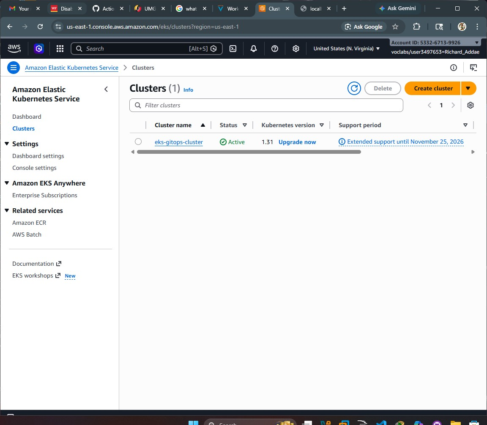

### 2. Node Group Created
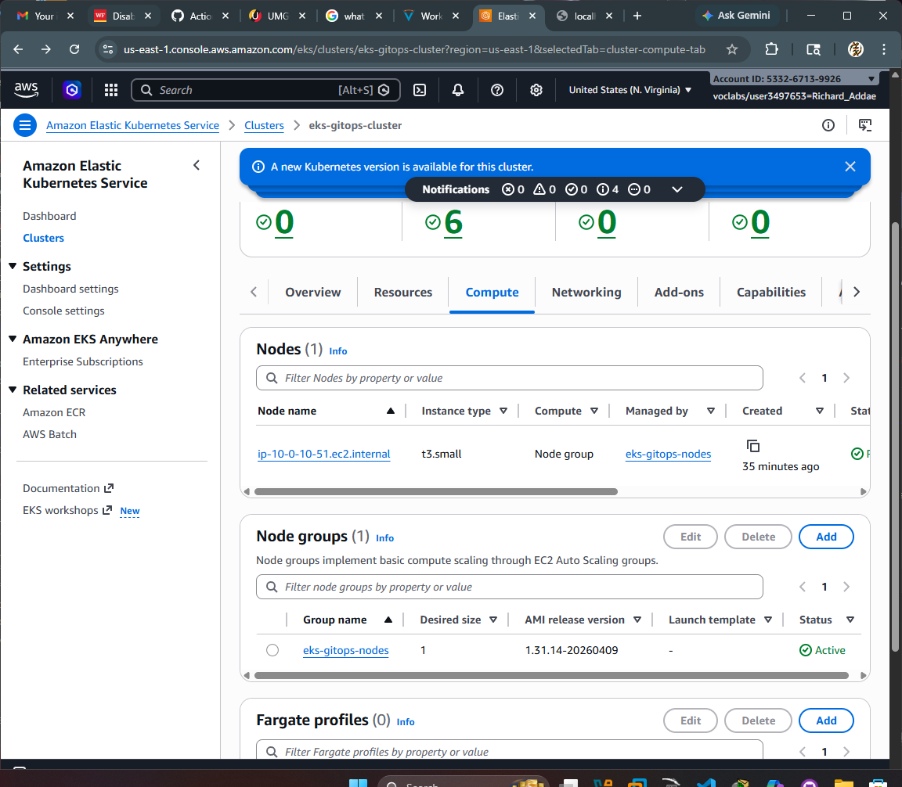

### 3. Kubernetes Nodes Registered
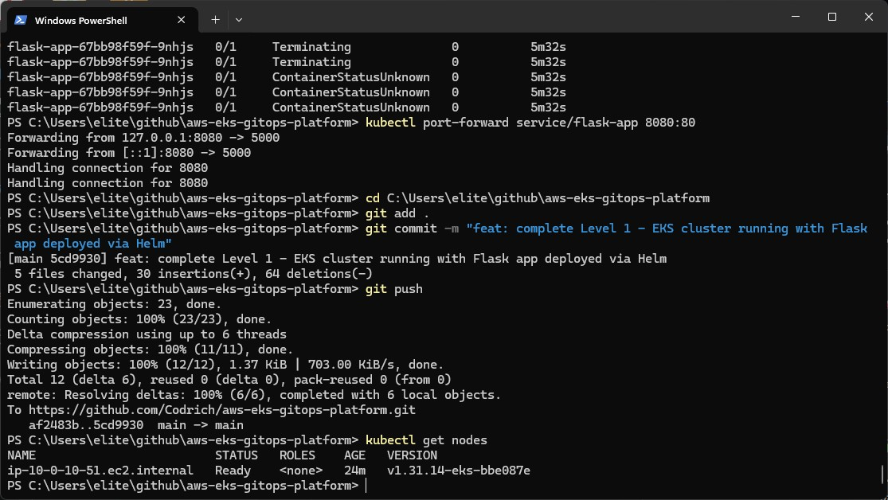

### 4. Application Pods Running
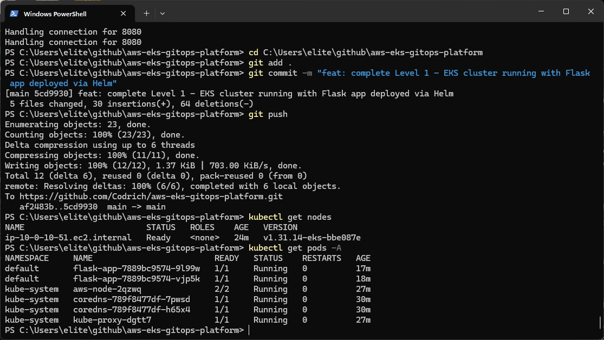

### 5. Service Exposes Application
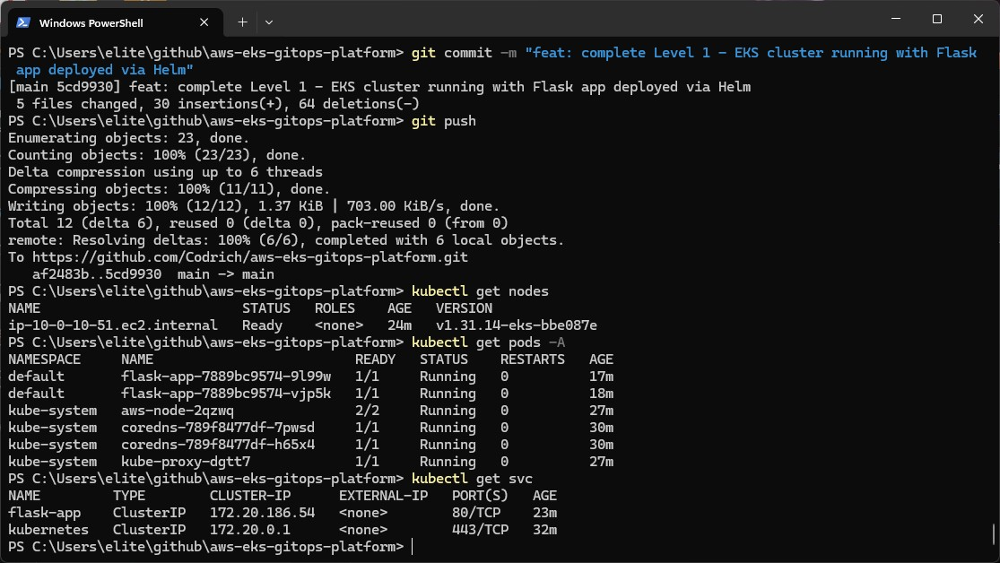

### 6. Deployment Configuration
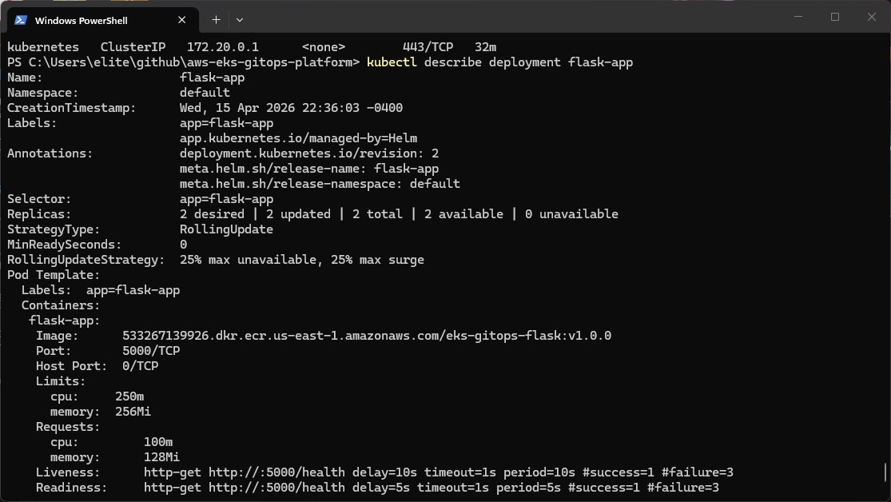
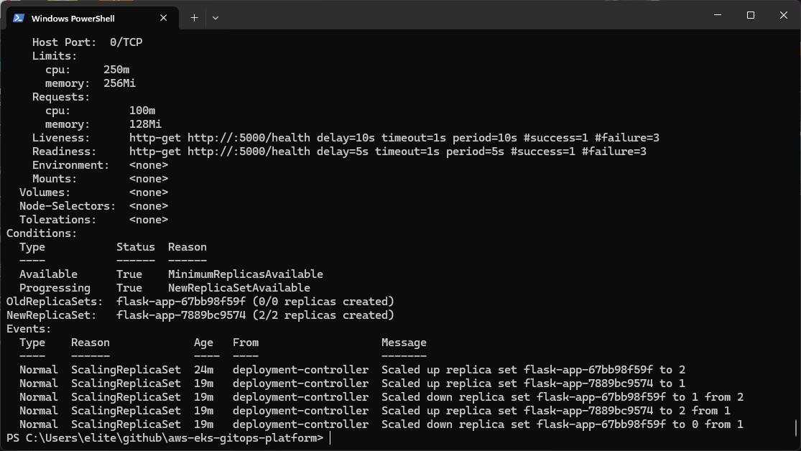

### 7. Application Accessible (Port Forward)
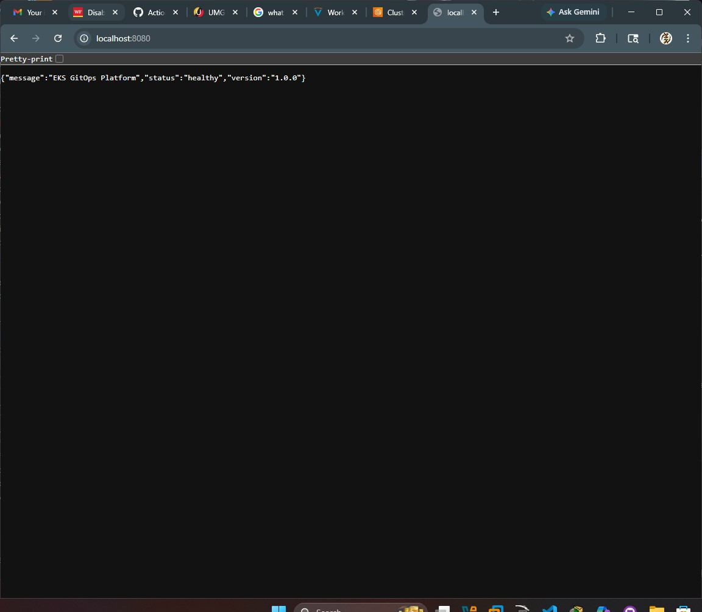

### 8. ArgoCD GitOps Sync
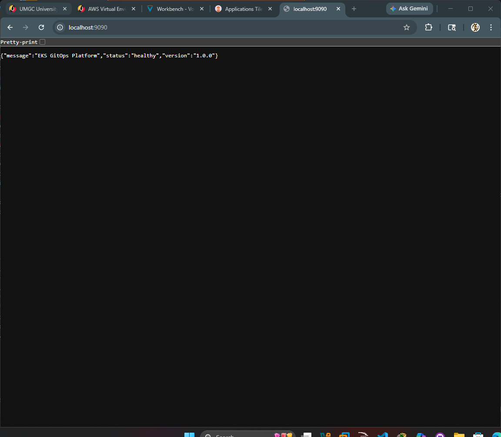

### 9. HPA Autoscaling

### 10. Grafana Kubernetes Dashboard
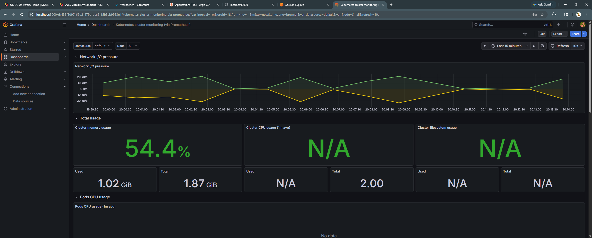

### 11. Container Memory Metrics
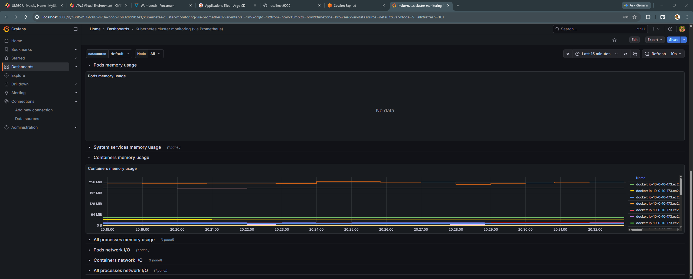

## 📈 Key Outcomes

- Built a fully automated CI/CD pipeline for Kubernetes deployments
- Deployed and managed containerized workloads on AWS EKS
- Implemented Infrastructure as Code using modular Terraform
- Configured GitOps continuous delivery with ArgoCD
- Set up full observability stack with Prometheus and Grafana
- Hardened cluster security with RBAC and Network Policies
- Demonstrated end-to-end application lifecycle from code to running container

> This project proves the ability to design, deploy, and operate a production-style cloud-native platform on AWS — independently, from scratch.

## ⚠️ Known Limitations (Learner Lab Environment)

- **Ingress / ALB Integration**
  The AWS Load Balancer Controller requires IRSA (IAM Roles for Service
  Accounts) and `elasticloadbalancing:*` permissions. The Vocareum Learner
  Lab restricts IAM role creation and policy attachment, preventing ALB
  provisioning. The Ingress manifests are fully implemented and
  production-ready for a standard AWS account.

- **GitHub Actions OIDC Integration**
  OIDC federation requires `iam:CreateRole`, which is restricted in the
  lab environment. The workflow configuration is included and
  production-ready.

## 💰 Cost Awareness

| Resource | Cost/hour | Notes |
|---|---|---|
| EKS Control Plane | $0.10 | Destroy when not in use |
| t3.small node (1x) | $0.023 | Destroy when not in use |
| NAT Gateway | $0.045 | Destroy when not in use |
| **Total** | **~$0.17/hr** | |

Always run `terraform destroy` after each session.

## 🔧 Troubleshooting

| Issue | Cause | Fix |
|---|---|---|
| `ErrImagePull` | Wrong ECR account ID | Update repository URL in values.yaml |
| Node group `CREATE_FAILED` | EC2 vCPU quota too low | Request quota increase |
| Pods Pending | Node at pod limit (11 for t3.small) | Remove unused deployments |
| ALB not provisioning | Missing IRSA configuration | Requires full AWS account |
